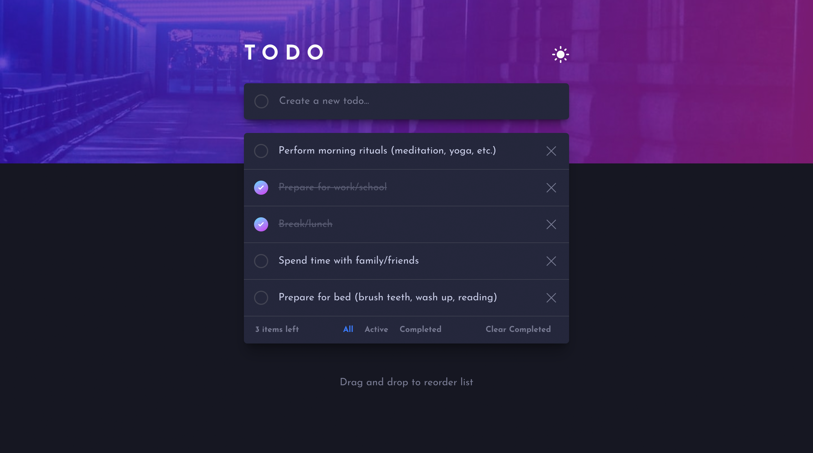
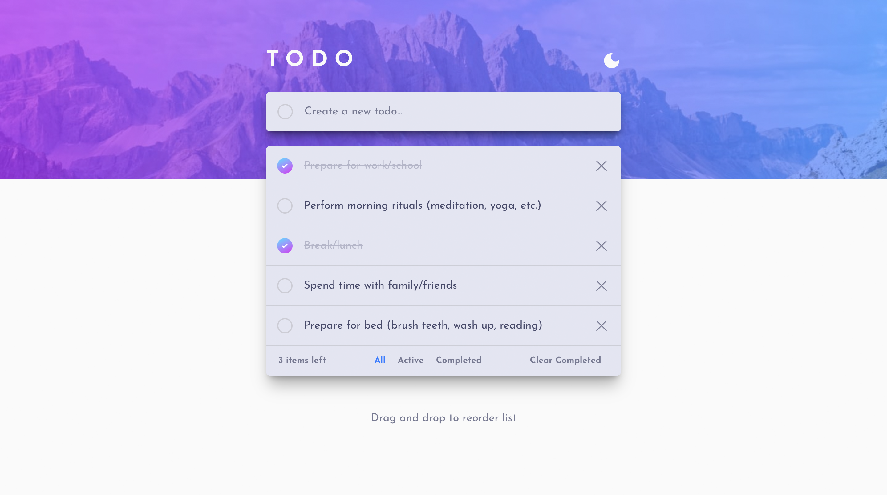
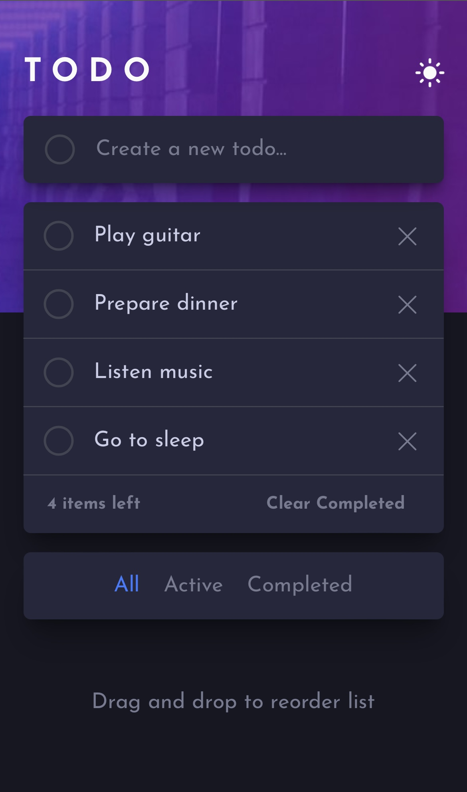

# React - TodoList

This is a simple todo application built with React.js. It allows users to create, update, and delete tasks, drag the task, sort the tasks, and change the theme from light to dark.

This is a solution to the [Todo app challenge on Frontend Mentor](https://www.frontendmentor.io/challenges/todo-app-Su1_KokOW).

## [TodoList](https://woltergray.github.io/toDoList/)

## Features

- Create new tasks
- Mark tasks as completed
- Deleting tasks
- Filter tasks by status (All, Active, Completed)
- Change the order of tasks using drag and drop
- Change themes: light dark

## Screenshot

## Installation

1. Clone the repository:

   		git clone https://github.com/wolterGray/toDoList.git

2. Install dependencies:

   		npm install

3. Run the development server:

   		npm run dev

Feel free to contribute or report issues!

## Technologies Used

- Semantic HTML5 markup
- CSS custom properties
- Flexbox
- Mobile-first workflow
- [React](https://reactjs.org/) - JS library
- [Styled Components](https://styled-components.com/) - For styles
- [Tailwind](https://tailwindcss.com/) - CSS framework packed with classes
- [Framer Motion](https://www.framer.com/motion/) - Animation library
- [React-icons](https://react-icons.github.io/react-icons/) - Icons Library

## Usage

1. Visit the [live demo](https://woltergray.github.io/toDoList/).
2. Create a new task by typing in the input field and pressing Enter.
3. Click on a task to mark it as completed.
4. Change the order of tasks using drag and drop.
5. Click on the cross icon to remove a task.
6. Change theme.
7. Use the filter buttons at the bottom to view tasks based on their status.

## License

This project is licensed under the MIT License

## Contact

- [Author](https://github.com/MMansy19)
- [Website](https://mahmoud-mansy-portfolio.netlify.app/)
- [Email](mailto:mahmoud2abdalfattah@gmail.com)
- [LinkedIn](https://www.linkedin.com/in/mahmoud-mansy-a189a5232)

## What I learned

In this project I honed my React.js skills, began to master the Tailwind framework, and worked with the interesting Frame Motion library.

### Continued development

I plan to continue mastering React; it’s also interesting to get to grips with TypeScript, and reach a new level of application creation.

## Acknowledgments

- Thank for the interesting challenge [Todo app challenge on Frontend Mentor](https://www.frontendmentor.io/challenges/todo-app-Su1_KokOW).
